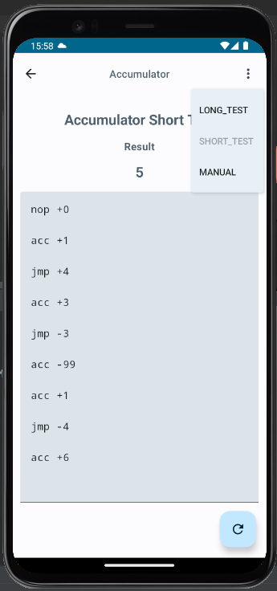
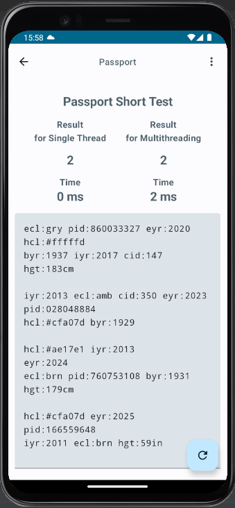

 
<h1 align="center">NiceHash Test Jetpack Compose Sample App</h1>

 
  

## Table of Contents

* [About the Project](#about-the-project)
* [Features](#features)
  * [How To](#how-to)
* [Test](#test)
  * [Results](#results)

## About The Project
App made with kotlin using Jetpack Compose.

## Features
- Users can test two algorithms.
- User can change which test data want to use
- User can manually change data

### How to
- Select on home page which test you want to use
- When on test in right upper corner you can select which data (long or short) you want to use
- You can manually change data
- When you are happy with changes click on FAB to trigger changes

## Test
  - androidTest for both screens - [androidTest](https://github.com/tilenPint/NicehashTest/tree/master/app/src/androidTest/java/com/example/nicehashtest)
  - unitTest for repository - [unitTest](https://github.com/tilenPint/NicehashTest/tree/master/app/src/test/java/com/example/nicehashtest/data/repository)

  ### Results

- Question 1 - [Algo](https://github.com/tilenPint/NicehashTest/blob/master/app/src/main/java/com/example/nicehashtest/data/repository/AccumulatorRepositoryImpl.kt)
  - <b>Immediately before any instruction is executed a second time,
    what value is in the accumulator? </b>
  - Result: <b> 1087 </b>
- Question 2.1 - [Algo](https://github.com/tilenPint/NicehashTest/blob/master/app/src/main/java/com/example/nicehashtest/data/repository/PassportRepositoryImpl.kt)
  - <b>Count the number of valid passports - those that have all required fields. Treat cid as optional. In
    your batch file, how many passports are valid? </b>
  - Result: <b> 15 </b>
- Question 2.2
  - <b>Prepare two solutions, one should be single threaded and the second multithreaded. Test it on a
      multicore machine and measure execution time difference.</b>
  - Result: Single threaded is faster then multithreaded usually.
    - Single threaded time: <b> 18ms </b>
    - Multithreaded time: <b> 74ms </b>